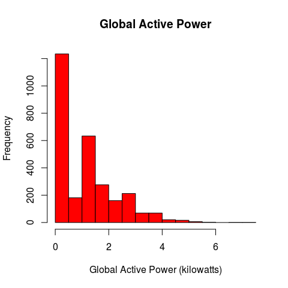
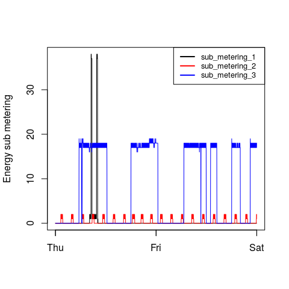
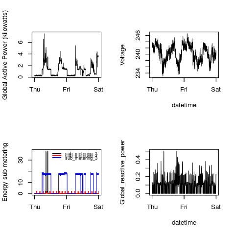

# ExData Course Project 1
Ronald Stalder  
`r Sys.Date()`  

## get and read the data

**Data Set Information from the [UCI web site](https://archive.ics.uci.edu/ml/datasets/Individual+household+electric+power+consumption#):**  

The file to be downloaded has been prepared by the course staff (uploaded to cloudfront)  

```
This archive contains 2075259 measurements gathered between December 2006 and November 2010 (47 months). 
Notes: 
1.(global_active_power*1000/60 - sub_metering_1 - sub_metering_2 - sub_metering_3) represents the active energy consumed every minute (in watt hour) in the household by electrical equipment not measured in sub-meterings 1, 2 and 3. 
2.The dataset contains some missing values in the measurements (nearly 1,25% of the rows). All calendar timestamps are present in the dataset but for some timestamps, the measurement values are missing: a missing value is represented by the absence of value between two consecutive semi-colon attribute separators. For instance, the dataset shows missing values on April 28, 2007.


Attribute Information:

1.date: Date in format dd/mm/yyyy 
2.time: time in format hh:mm:ss 
3.global_active_power: household global minute-averaged active power (in kilowatt) 
4.global_reactive_power: household global minute-averaged reactive power (in kilowatt) 
5.voltage: minute-averaged voltage (in volt) 
6.global_intensity: household global minute-averaged current intensity (in ampere) 
7.sub_metering_1: energy sub-metering No. 1 (in watt-hour of active energy). It corresponds to the kitchen, containing mainly a dishwasher, an oven and a microwave (hot plates are not electric but gas powered). 
8.sub_metering_2: energy sub-metering No. 2 (in watt-hour of active energy). It corresponds to the laundry room, containing a washing-machine, a tumble-drier, a refrigerator and a light. 
9.sub_metering_3: energy sub-metering No. 3 (in watt-hour of active energy). It corresponds to an electric water-heater and an air-conditioner.
```


```r
library(data.table, warn.conflicts = FALSE, quietly = TRUE, verbose=FALSE)

dataFile <- "household_power_consumption.txt"
zipFile <- "household_power_consumption.zip"

if (!file.exists(dataFile)) {
  url <- "https://d396qusza40orc.cloudfront.net/exdata%2Fdata%2Fhousehold_power_consumption.zip"
  download.file(url, zipFile, method="curl", mode="wb")
  unzip(zipFile, setTimes=TRUE)
}

print(paste("the file", dataFile, 
            "was downloaded/extracted on:", file.info(zipFile)$mtime))

# read the file into data.table, grepping only dates 1/2/2007 and 2/2/2007 
## LIGHTENING FAST!!
DT <- fread(
  paste("grep ^[12]/2/2007", dataFile),
  na.strings = c("?", ""))
# "grep" lost the headers, so get them
setnames(DT, colnames(fread(dataFile, nrows=0)))

# better, but slower: keeps the first line
# DT <- fread(
#   paste("sed '1p;/^[12]\\/2\\/2007/!d'", dataFile),
#   na.strings = c("?", ""))


# get English day names
Sys.setlocale(category = "LC_TIME", locale = "C")

# convert Date,Time to POSIXct
DT <- DT[, DateTime:=as.POSIXct(paste(Date,Time),             # convert Date,Time to DateTime
                                format="%d/%m/%Y %H:%M:%S", tz="UTC")
       ][, `:=`(Date=NULL, Time=NULL)                         # eliminate Date,Time cols
       ]
```

```
## [1] "the file household_power_consumption.txt was downloaded/extracted on: 2015-01-05 19:35:56"
## [1] "C"
```

## plot1: Histogram of "Global Active Power"  


```r
# prepare the plot
hist(DT$Global_active_power,
     col = "red",
     bg = "white",
     main = "Global Active Power",
     xlab = "Global Active Power (kilowatts)")
```

 

```r
# copy the screen plot to png file
dev.copy(png, file = "plot1.png",
              width = 480, height = 480, units = "px")
dev.off() ## Don't forget to close the PNG device!
```

## plot2: Timeline of "Global Active Power"  


```r
# prepare the plot
plot(DT$DateTime, DT$Global_active_power,
     type = "l",                                   # line plot
     bg = "white",
     xlab = NA,                                    # no label for x-axis
     ylab = "Global Active Power (kilowatts)")
```

 

```r
# copy the screen plot to png file
dev.copy(png, file = "plot2.png",
              width = 480, height = 480, units = "px")
dev.off() ## Don't forget to close the PNG device!
```

## plot3: Timeline of Sub-Meterings 1, 2 and 3


```r
# prepare plot, take sub_metering_1 for y-axis as it has the highest max
plot(DT$DateTime, DT$Sub_metering_1,
     type = "l", col="black", lty="solid", lwd=1,
     bg = "white",
     xlab = NA,
     ylab = "Energy sub metering")
lines(DT$DateTime, DT$Sub_metering_2, type="l", col="red", lty="solid", lwd=1)
lines(DT$DateTime, DT$Sub_metering_3, type="l", col="blue", lty="solid", lwd=1)
legend("topright", lty = "solid", lwd = 2, cex = .8,
       col = c("black", "red", "blue"), 
       legend = c("sub_metering_1 ", "sub_metering_2 ", "sub_metering_3 "))
```

 

```r
# copy the screen plot to png file
dev.copy(png, file = "plot3.png",
              width = 480, height = 480, units = "px")
dev.off() ## Don't forget to close the PNG device!
```

## plot4: 2x2 Multiple Base Plot


```r
par(mfrow = c(2,2))
with(DT, {

### @[1,1]: same as Plot 2

plot(DateTime, Global_active_power,
     type = "l",                                   # line plot
     xlab = NA,                                    # no label for x-axis
     ylab = "Global Active Power (kilowatts)")

### @[1,2]: like Plot 2, but with Voltage

plot(DateTime, Voltage,
     type = "l",                                   # line plot
     xlab = "datetime",
     ylab = "Voltage")

### @[2,1]: same as Plot 3

plot(DateTime, Sub_metering_1,
     type = "l", col="black", lty="solid", lwd=1,
     xlab = NA,
     ylab = "Energy sub metering")
lines(DateTime, Sub_metering_2, type="l", col="red", lty="solid", lwd=1)
lines(DateTime, Sub_metering_3, type="l", col="blue", lty="solid", lwd=1)
legend("topright", lty = "solid", lwd = 2, 
       bty = "n",                             # no box drawn
       cex = 0.7, y.intersp = 0.4,
       col = c("black", "red", "blue"), 
       legend = c("sub_metering_1 ", "sub_metering_2 ", "sub_metering_3 "))

### @[2,2]: like Plot 2, but with Global_reactive_power

plot(DateTime, Global_reactive_power,
     type = "l",
     col="black",
     xlab = "datetime",
     ylab = "Global_reactive_power")
  
})  ## end of with(DT...)
```

 

```r
# copy the screen plot to png file
dev.copy(png, file = "plot4.png",
              width = 480, height = 480, units = "px")
dev.off() ## Don't forget to close the PNG device!
```
